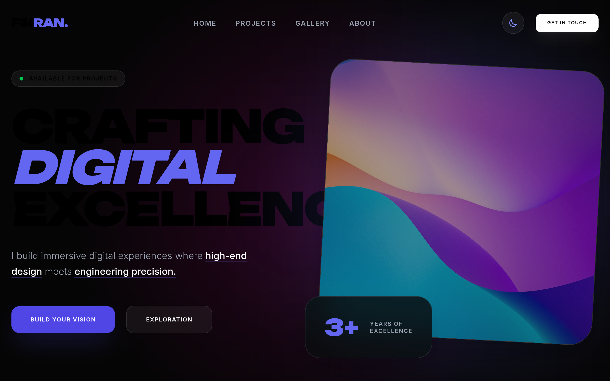

# fikranse DESIGN.md

> Auto-generated design system — reverse-engineered via static analysis by skillui.
> Frameworks: None detected
> Colors: 11 · Fonts: 3 · Components: 6
> Icon library: not detected · State: not detected
> Primary theme: light · Dark mode toggle: no · Motion: subtle

## Visual Reference

**Match this design exactly** — study colors, fonts, spacing, and component shapes before writing any UI code.



---

## 1. Visual Theme & Atmosphere

This is a **light-themed** interface with a warm, approachable feel. The light background emphasizes content clarity. Typography pairs **Inter** for display/headings with **Unbounded** for body text, creating clear visual hierarchy through type contrast. Spacing follows a **4px base grid** (compact density), with scale: 4, 8, 12, 16, 20, 24, 28, 32px. The accent color **#fb2c36** anchors interactive elements (buttons, links, focus rings). Motion is subtle — smooth transitions (150-300ms) ease state changes without drawing attention.

---

## 2. Color Palette & Roles

| Token | Hex | Role | Use |
|---|---|---|---|
| tw-ring-offset-color | `#ffffff` | background | Page background, darkest surface |
| color-indigo-400 | `#818cf8` | surface | Card and panel backgrounds |
| color-black | `#000000` | text-primary | Headings and body text |
| border | `#222222` | border | Dividers, card borders, outlines |
| accent | `#fb2c36` | accent | CTAs, links, focus rings, active states |
| danger | `#fe6e00` | danger | Error states, destructive actions |
| success | `#00bb7f` | success | Success states, positive indicators |
| color-indigo-500 | `#6366f1` | info | Informational highlights |
| color-indigo-600 | `#4f46e5` | unknown | Palette color |
| color-violet-500 | `#8b5cf6` | unknown | Palette color |
| unknown | `#0a0a0b` | unknown | Palette color |

### CSS Variable Tokens

```css
--tw-border-style: solid;
--tw-border-style: dashed;
--tw-border-style: solid;
--tw-border-style: dashed;
--tw-border-style: solid;
--tw-border-style: dashed;
--tw-border-style: solid;
--tw-border-style: dashed;
```


---

## 3. Typography Rules

**Font Stack:**
- **Unbounded** — Heading 1, Heading 2, Heading 3
- **Inter** — Body, Caption
- **SFMono-Regular** — Code

**Font Sources:**

```css
@font-face {
  font-family: "Inter";
  src: url("fonts/Inter-Bold.ttf") format("truetype");
  font-weight: 700;
}
@font-face {
  font-family: "Inter";
  src: url("fonts/Inter-Regular.ttf") format("truetype");
  font-weight: 400;
}
@font-face {
  font-family: "Unbounded";
  src: url("fonts/Unbounded-Bold.ttf") format("truetype");
  font-weight: 700;
}
@font-face {
  font-family: "Unbounded";
  src: url("fonts/Unbounded-Regular.ttf") format("truetype");
  font-weight: 400;
}
```

| Role | Font | Size | Weight |
|---|---|---|---|
| Heading 1 | Unbounded | 10px | 700 |
| Heading 2 | Unbounded | 9px | 700 |
| Heading 3 | Unbounded | 8px | 700 |
| Body | Inter | inherit | 400 |
| Caption | Inter | 1em | 400 |
| Code | SFMono-Regular | 14px | 400 |

**Typographic Rules:**
- Limit to 3 font families max per screen
- Use **Unbounded** for body/UI text, **Inter** for display/headings
- Maintain consistent hierarchy: no more than 3-4 font sizes per screen
- Headings use bold (600-700), body uses regular (400)
- Line height: 1.5 for body text, 1.2 for headings
- Use color and opacity for secondary hierarchy, not additional font sizes


---

## 4. Component Stylings

### Navigation (1)

**Navigation** — `html`

### Data Input (1)

**Button** — `html`
- Animation: 

### Overlay (1)

**Modal** — `html`

### Media (3)

**Image** — `html`

**Icon** — `html`

**Map/Canvas** — `html`


---

## 5. Layout Principles

- **Base spacing unit:** 4px
- **Spacing scale:** 4, 8, 12, 16, 20, 24, 28, 32, 36, 40, 44, 48
- **Border radius:** 2rem, 2.5rem, 3rem, 3.5rem, 4rem, 5rem, 10px, 12px

**Spacing as Meaning:**
| Spacing | Use |
|---|---|
| 4-8px | Tight: related items within a group |
| 12-16px | Medium: between groups |
| 24-32px | Wide: between sections |
| 48px+ | Vast: major section breaks |


---

## 6. Depth & Elevation

No box-shadow values detected. The design appears to use a flat visual style.

**Z-Index Scale:** `100, 105, 110`


---

## 7. Animation & Motion

This project uses **subtle motion**. Transitions smooth state changes without demanding attention.

### CSS Animations

- `@keyframes pulse`

### Animated Components

- **Button**: 

### Motion Guidelines

- Duration: 150-300ms for micro-interactions, 300-500ms for page transitions
- Easing: `ease-out` for enters, `ease-in` for exits
- Always respect `prefers-reduced-motion`


---

## 8. Do's and Don'ts

### Do's

- Use `#fb2c36` for interactive elements (buttons, links, focus rings)
- Use `#ffffff` as the primary page background
- Pair **Unbounded** (body) with **Inter** (display) — these are the only allowed fonts
- Follow the **4px** spacing grid for all margins, padding, and gaps
- Use border and background shifts for elevation — not shadows
- Use border-radius from the scale: 2rem, 2.5rem, 3rem, 3.5rem, 4rem
- Reuse existing components from Section 4 before creating new ones

### Don'ts

- Don't introduce colors outside this palette — extend the design tokens first
- Don't introduce additional font families beyond Unbounded and Inter and SFMono-Regular
- Don't use arbitrary spacing values — stick to multiples of 4px
- Don't add box-shadow — this design system uses flat elevation
- Don't use arbitrary border-radius values — pick from the defined scale
- Don't duplicate component patterns — check Section 4 first
- Don't use backdrop-blur or blur effects

### Anti-Patterns (detected from codebase)

- No box-shadow on any element
- No blur or backdrop-blur effects
- No zebra striping on tables/lists


---

## 9. Responsive Behavior

| Name | Value | Source |
|---|---|---|
| sm | 40rem | css |
| md | 48rem | css |
| lg | 64rem | css |
| xl | 80rem | css |

**Approach:** Use `@media (min-width: ...)` queries matching the breakpoints above.


---

## 10. Agent Prompt Guide

Use these as starting points when building new UI:

### Build a Card

```
Background: #818cf8
Border: 1px solid #222222
Radius: 4rem
Padding: 16px
Font: Unbounded
No shadows — use borders and surface colors for depth.
```

### Build a Button

```
Primary: bg #fb2c36, text white
Ghost: bg transparent, border #222222
Padding: 8px 16px
Radius: 4rem
Hover: opacity 0.9 or lighter shade
Focus: ring with #fb2c36
```

### Build a Page Layout

```
Background: #ffffff
Max-width: 1280px, centered
Grid: 4px base
Responsive: mobile-first, breakpoints from Section 9
```

### Build a Stats Card

```
Surface: #818cf8
Label: var(--text-muted) (muted, 12px, uppercase)
Value: #000000 (primary, 24-32px, bold)
Status: use success/warning/danger from Section 2
```

### Build a Form

```
Input bg: #ffffff
Input border: 1px solid #222222
Focus: border-color #fb2c36
Label: var(--text-muted) 12px
Spacing: 16px between fields
Radius: 4rem
```

### General Component

```
1. Read DESIGN.md Sections 2-6 for tokens
2. Colors: only from palette
3. Font: Unbounded, type scale from Section 3
4. Spacing: 4px grid
5. Components: match patterns from Section 4
6. Elevation: flat, surface shifts
```
